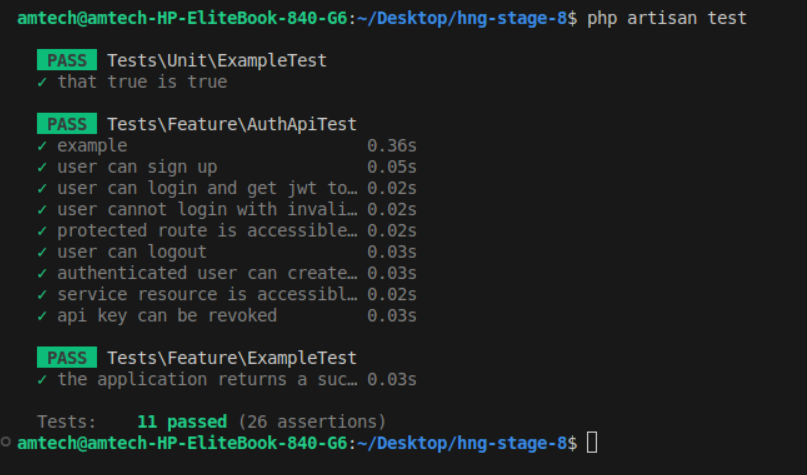

<p align="center"><a href="https://laravel.com" target="_blank"></a></p>

<p align="center">
<a href="https://github.com/laravel/framework/actions"></a>
<a href="https://packagist.org/packages/laravel/framework"></a>
<a href="https://packagist.org/packages/laravel/framework"></a>
<a href="https://packagist.org/packages/laravel/framework"></a>
</p>

## Project




On this week HNG project I built in Laravel.

-   Task 3:

Wallet Service with Paystack, JWT & API Keys

I started by cloning the previous stage 7 project.

Add the Configure key to my .env file.

I added the controllers and logics.

I write some test for it.

I test the application endpoints.

I test it again.

I push to GitHub.

I deploy the project to Railway.

Then I test the project to see how it works.

Thanks.

    Live endpoint: https://hngi13-backend-task-production.up.railway.app/api/google

## Run the project locally

```sh
    # clone the project
    git clone https://github.com/abdulsalamamtech/hng-stage-8

    # cd into the stage-3 project folder
    cd hng-stage-8

    # install dependencies
    composer install

    # Seed the database
    php artisan migrate:fresh --seed

    # Test the app
    php artisan test

    # run the project
    php artisan serve

    # visit the endpoint
    https://localhost:8000/api/auth/google

```

## brief reason for each technology or library used

php-open-source-saver/jwt-auth: "This is the go-to package for standard user authentication in a Laravel API. It handles creating, validating, and blacklisting tokens for user login and logout, keeping your application stateless."

Laravel Sanctum: "While JWT is great for short-lived user sessions, Sanctum is Laravel's official, lightweight API key system perfect for service-to-service communication. It provides the easy createToken() method and handles key revocation and expiration."

Trait HasApiTokens: We added this trait to the User model to enable the Sanctum API key functionality. It's the engine that gives your model the ability to generate and manage API keys instantly.

Interface JWTSubject: We implemented this interface on the User model to let the JWT package know how to identify the user (getJWTIdentifier) and what custom data to include in the token payload (getJWTCustomClaims).

## Endpoint

User Authentication Flow (JWT)

| S/N | Step    | Endpoint         | Method | Authentication Type | Body Parameters         |
| --- | ------- | ---------------- | ------ | ------------------- | ----------------------- |
| 1.  | Sign Up | /api/auth/signup | POST   | None                | "name, email, password" |
| 2.  | Login   | /api/auth/login  | POST   | None                | "email, password"       |
| 3.  | Logout  | /api/auth/logout | POST   | JWT Bearer Token    | None                    |

Service-to-Service Access (API Keys / Sanctum)

| S/N | Step       | Endpoint                   | Method | Headers                           | Body                                           | Authentication Type     | Body Parameters |
| --- | ---------- | -------------------------- | ------ | --------------------------------- | ---------------------------------------------- | ----------------------- | --------------- |
| 1.  | Create Key | /api/keys/create           | POST   | Authorization: Bearer <JWT_TOKEN> | {"name": "ServiceName", "expires_in_days": 30} | "name, email, password" |
| 2.  | Login      | /api/keys/{tokenId}/revoke | DELETE | Authorization: Bearer <JWT_TOKEN> |                                                |                         | tokenId         |

-   Test documentation on [POSTMAN](https://www.postman.com/sdnss2/workspace/hng/collection)

## My Workings

```sh
# Install Laravel
laravel new hng-stage-8

# Install Laravel jwt-auth
# Guide: https://jwt-auth.readthedocs.io/en/develop/quick-start/

composer require php-open-source-saver/jwt-auth

php artisan vendor:publish --provider="PHPOpenSourceSaver\JWTAuth\Providers\LaravelServiceProvider"

php artisan jwt:secret

# Install api
php artisan install:api

# AuthComposer
php artisan make:controller AuthController

# Install Socialite
# Guide: https://laravel-news.com/connecting-laravel-socialite-with-google-client-php-library
composer create-project laravel/laravel google
composer require laravel/socialite
```

## Setting up dev to prod

```sh
# Run PHPStan (Larastan)
./vendor/bin/phpstan analyse --memory-limit=2G

# Check code style (Laravel Pint)
./vendor/bin/pint --test

# Run PHPUnit tests with coverage
./vendor/bin/phpunit --stop-on-failure --coverage-text --coverage-clover=coverage.xml | tee phpunit.log

```

## About Laravel

Laravel is a web application framework with expressive, elegant syntax. We believe development must be an enjoyable and creative experience to be truly fulfilling. Laravel takes the pain out of development by easing common tasks used in many web projects, such as:

-   [Simple, fast routing engine](https://laravel.com/docs/routing).
-   [Powerful dependency injection container](https://laravel.com/docs/container).
-   Multiple back-ends for [session](https://laravel.com/docs/session) and [cache](https://laravel.com/docs/cache) storage.
-   Expressive, intuitive [database ORM](https://laravel.com/docs/eloquent).
-   Database agnostic [schema migrations](https://laravel.com/docs/migrations).
-   [Robust background job processing](https://laravel.com/docs/queues).
-   [Real-time event broadcasting](https://laravel.com/docs/broadcasting).

Laravel is accessible, powerful, and provides tools required for large, robust applications.

## Learning Laravel

Laravel has the most extensive and thorough [documentation](https://laravel.com/docs) and video tutorial library of all modern web application frameworks, making it a breeze to get started with the framework. You can also check out [Laravel Learn](https://laravel.com/learn), where you will be guided through building a modern Laravel application.

If you don't feel like reading, [Laracasts](https://laracasts.com) can help. Laracasts contains thousands of video tutorials on a range of topics including Laravel, modern PHP, unit testing, and JavaScript. Boost your skills by digging into our comprehensive video library.

## Laravel Sponsors

We would like to extend our thanks to the following sponsors for funding Laravel development. If you are interested in becoming a sponsor, please visit the [Laravel Partners program](https://partners.laravel.com).

### Premium Partners

-   **[Vehikl](https://vehikl.com)**
-   **[Tighten Co.](https://tighten.co)**
-   **[Kirschbaum Development Group](https://kirschbaumdevelopment.com)**
-   **[64 Robots](https://64robots.com)**
-   **[Curotec](https://www.curotec.com/services/technologies/laravel)**
-   **[DevSquad](https://devsquad.com/hire-laravel-developers)**
-   **[Redberry](https://redberry.international/laravel-development)**
-   **[Active Logic](https://activelogic.com)**

## Contributing

Thank you for considering contributing to the Laravel framework! The contribution guide can be found in the [Laravel documentation](https://laravel.com/docs/contributions).

## Code of Conduct

In order to ensure that the Laravel community is welcoming to all, please review and abide by the [Code of Conduct](https://laravel.com/docs/contributions#code-of-conduct).

## Security Vulnerabilities

If you discover a security vulnerability within Laravel, please send an e-mail to Taylor Otwell via [taylor@laravel.com](mailto:taylor@laravel.com). All security vulnerabilities will be promptly addressed.

## License

The Laravel framework is open-sourced software licensed under the [MIT license](https://opensource.org/licenses/MIT).
